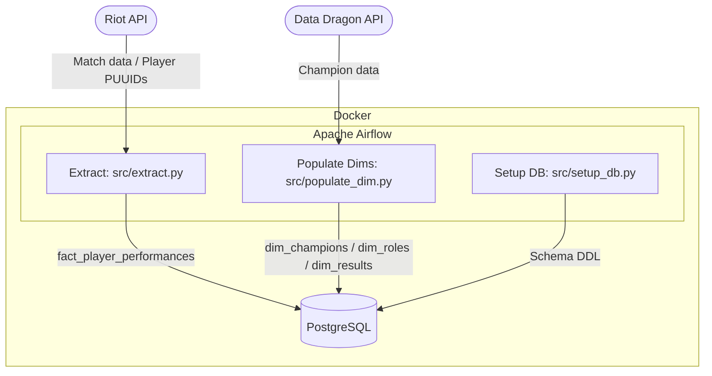

# lol-etl

An ETL pipeline for extracting, transforming, and loading League of Legends match data using the Riot Games API into a PostgreSQL data warehouse.

## Overview

This project pulls match history and player performance data from the Riot Games API and loads it into a star-schema PostgreSQL database. It supports multiple players and is designed to run as an Apache Airflow pipeline.

## Architecture (WIP) 🚧



## Project Structure (WIP) 🚧

```
├── src/                    # Core ETL logic
│   ├── extract.py          # Match extraction and fact table loading
│   ├── lol_api_service.py  # Riot API handler classes (dispatch pattern)
│   ├── lol_backend_service.py  # Legacy Riot API client
│   ├── populate_dim.py     # Dimension table population (champions, roles, results)
│   ├── setup_db.py         # Database schema setup
│   ├── reset_db.py         # Database reset
│   ├── set_environment.py  # Environment variable loader (.env + defaults)
│   ├── constants.py        # API cluster and endpoint enums
│   └── utils.py            # Shared HTTP and data helpers
├── interface/
│   └── database.py         # DatabaseClient abstraction (PostgreSQL + SQLite)
├── db/
│   ├── setup_pg.sql        # PostgreSQL schema DDL
│   ├── reset_pg.sql        # Drop/truncate script
│   └── setup_sqlite.sql    # SQLite schema (dev/testing)
├── static/
│   ├── champion.json       # Champion reference data
│   ├── roles.json          # Role dimension seed data
│   └── result.json         # Result dimension seed data
└── tests/                  # Test suite
```

## Database Schema (WIP) 🚧

The warehouse uses a star schema centred on `fact_player_performances`:

| Table | Description |
|---|---|
| `fact_player_performances` | One row per player per match (kills, deaths, assists, gold, damage, vision, CS) |
| `dim_players` | Player PUUID and Riot ID |
| `dim_matches` | Match ID and game mode |
| `dim_champions` | Champion ID and name (sourced from Data Dragon) |
| `dim_roles` | Role/position lookup |
| `dim_results` | Win/loss lookup |
| `processed_matches` | Deduplication tracking for processed matches |

## Prerequisites

- Python >= 3.12
- Docker
- Apache Airflow
- PostgreSQL instance
- Riot Games API key ([obtain here](https://developer.riotgames.com/))

## Key Components (WIP) 🚧

### `RiotAPI` (dispatch pattern)

`src/lol_api_service.py` implements a handler-based dispatch pattern. Each API operation is a separate class inheriting from `RiotHandler`:

- `GetPuuidByRiotId` — resolve Riot ID to PUUID
- `GetRiotIdByPuuid` — reverse PUUID lookup
- `GetMatchList` — fetch list of match IDs for a player
- `GetMatchData` — fetch full match JSON
- `GetFreeChampRotation` — fetch free champion rotation

```python
riot_api = RiotAPI(api_key)
puuid = riot_api.dispatch("GetPuuidByRiotId", "Matyoww", "3263")
matches = riot_api.dispatch("GetMatchList", "SEA", puuid, count=20)
```

### `DatabaseClient` (abstraction layer)

`interface/database.py` provides a common interface over PostgreSQL (`psycopg3`) and SQLite, making it straightforward to run the pipeline locally against SQLite or in production against PostgreSQL.

### `PopulateDim`

Dynamically reads column names from the target table and inserts seed data, supporting both in-memory data and JSON file sources with `ON CONFLICT DO NOTHING` for idempotent runs.

## Dependencies

| Package | Purpose |
|---|---|
| `apache-airflow` | Pipeline orchestration |
| `pandas` | DataFrame handling during extraction |
| `psycopg[binary]` | PostgreSQL driver |
| `requests` | HTTP calls to Riot and Data Dragon APIs |
| `pytest` | Testing |
| `coverage` | Test coverage reporting |

## Supported API Clusters

| Cluster | Base URL |
|---|---|
| `ASIA` | `https://asia.api.riotgames.com` |
| `SEA` | `https://sea.api.riotgames.com` |
| `PH2` | `https://ph2.api.riotgames.com` |

## Running Tests

```bash
pytest tests/
```

With coverage:

```bash
coverage run -m pytest tests/ && coverage report
```
